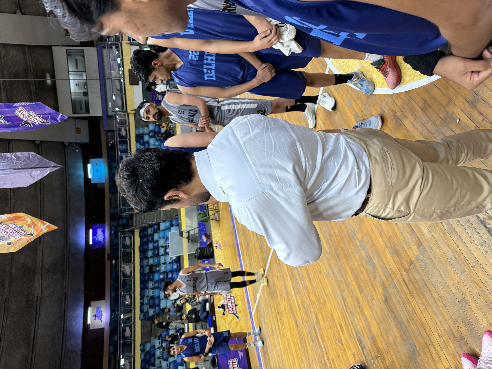
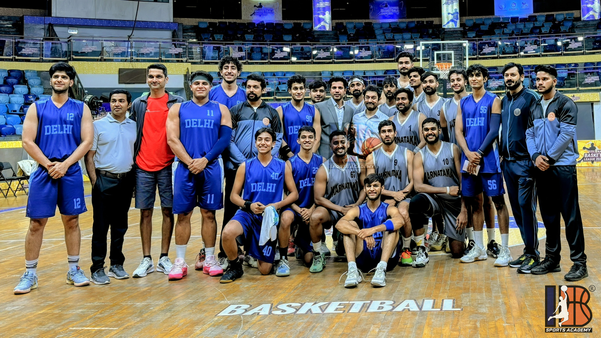
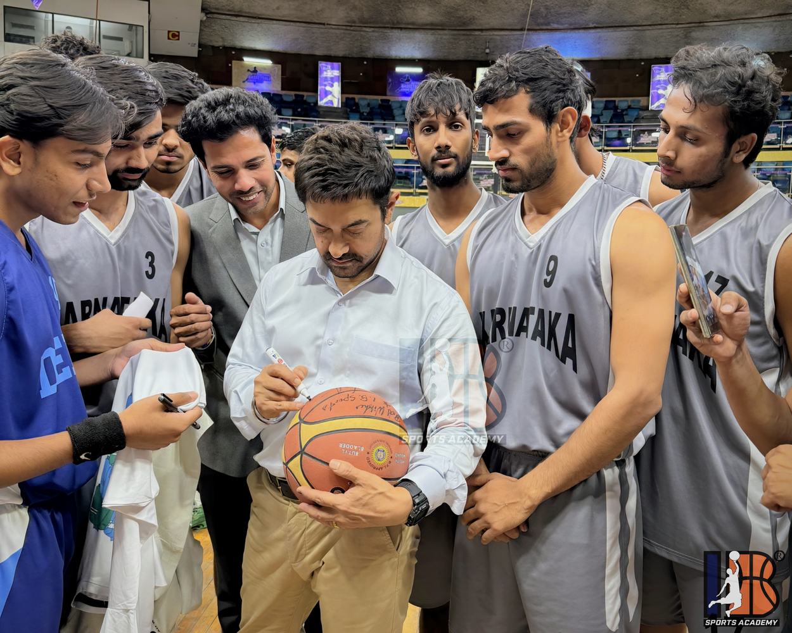
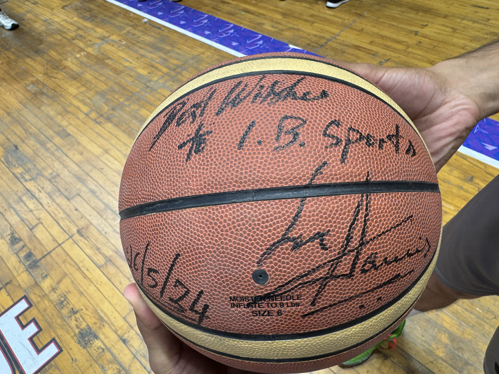
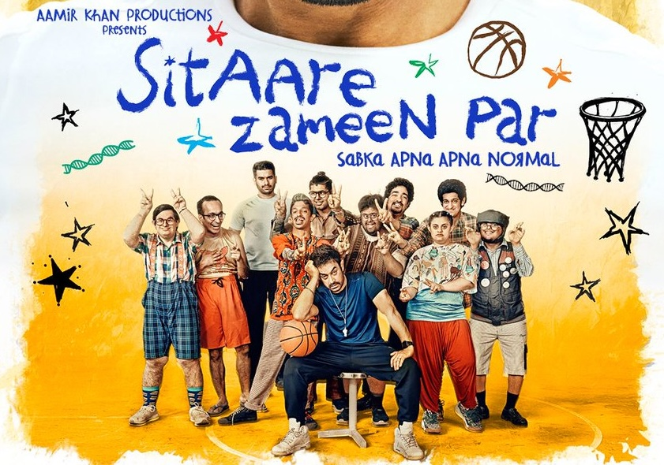
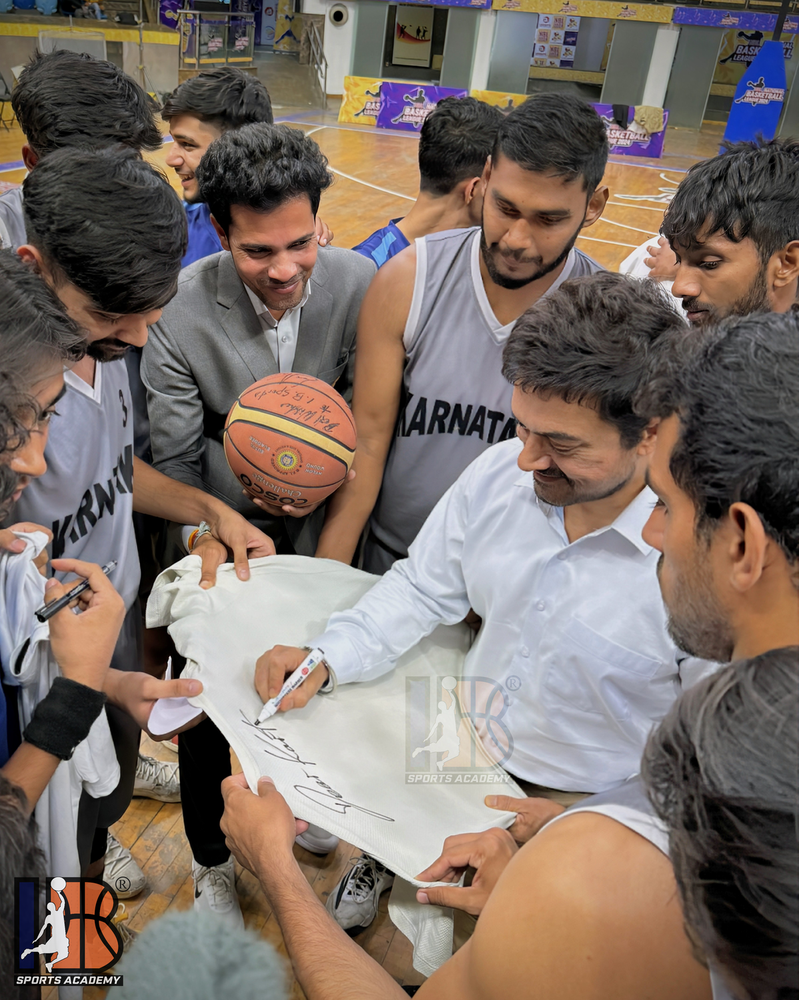
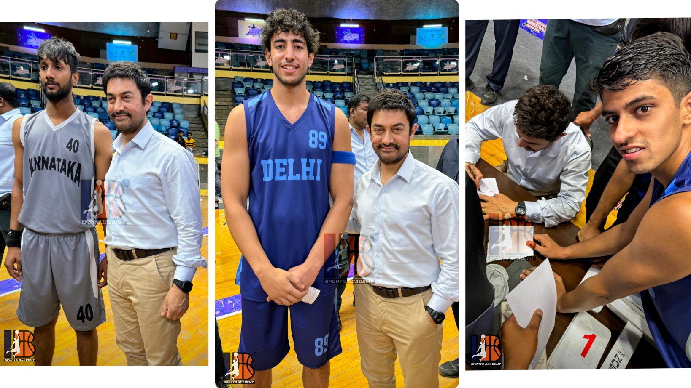

> *"Every child is a star. Some shine on the court. Some on the screen. And some, on both."*
> — Aamir Khan x IB Sports Academy

## ✨ Magic of Collaboration: IB x Aamir Khan

In a country where cricket often overshadows other sports, something extraordinary happened behind the scenes of a Bollywood production. **Aamir Khan Productions**, while developing their emotionally charged new film **Sitaare Zameen Par**, reached out to IB Sports Academy, not just to borrow a backdrop, but to embed truth, grit, and raw inspiration into the heart of their film.

Over weeks of collaboration, IB provided more than just basketball courts. We provided **youth athletes, creative feedback, location access, technical guidance**, and most importantly — **authenticity**. This wasn’t just a shoot. It was a shared mission.

<figure style="display: flex; flex-direction: column; align-items: center; text-align: center;">
  
  <figcaption style="font-style: italic;">Reel Meets Real — Aamir Khan steps into character as the coach, guided by the real one: Ishwar Bhati, the Head Coach of IB Sports Academy.</figcaption>
</figure>

It all culminated in a celebratory photoshoot and heartfelt interaction session, bringing together our young athletes, **Head Coach Ishwar Bhati**, and the legend himself, **Aamir Khan**, where stars from two very different worlds met, face to face.

## 🏀 From Coaching Drills to Camera Rolls

Imagine the scene: bright-eyed athletes aged 12 to 17, jerseys crisp, sneakers laced, hearts pounding. Not for a final buzzer shot, but to share space with a man who’s been inspiring India for decades.

Aamir didn’t come to watch a match. He came to thank. To listen. To inspire. The players from Delhi stood proudly alongside him, not as extras, but as **collaborators** in a story bigger than themselves.

<figure style="display: flex; flex-direction: column; align-items: center; text-align: center;">
  
  <figcaption style="font-style: italic;">When stars align: Aamir Khan with IB Sports Academy athletes and crew.</figcaption>
</figure>

He signed basketballs. Jerseys. Even blank pages, each a canvas for dreams yet to be written. But most importantly, he signed off on a message: **“You matter. Your story matters. And India needs to see you shine.”**

<figure style="display: flex; flex-direction: column; align-items: center; text-align: center;">
  
  <figcaption style="font-style: italic;">Every autograph carries a story — this one, written in sweat, discipline, and dreams.</figcaption>
</figure>

<figure style="display: flex; flex-direction: column; align-items: center; text-align: center;">
  
  <figcaption style="font-style: italic;">More than just ink — a message of belief, straight from Aamir Khan to the IB family.</figcaption>
</figure>

## 🎬 About **Sitaare Zameen Par**: A Film with Heart

Directed by the visionary Aamir Khan, **Sitaare Zameen Par** is a spiritual successor to **Taare Zameen Par** but this time, the spotlight is on the **hidden champions of the field, the court, and beyond**.

This movie is a celebration of children who defy odds — who express themselves not through conventional excellence but through passion, perseverance, and raw talent. Themes of **neurodiversity**, **resilience**, **dream-chasing**, and **mentorship** echo through every frame.

<figure style="display: flex; flex-direction: column; align-items: center; text-align: center;">
  
  <figcaption style="font-style: italic;">Sabka Apna Apna Normal - Sitaare Zameen Par by Aamir Khan Productions</figcaption>
</figure>

That’s why IB Sports made sense.

> We don't just build athletes. We build stories. We shape futures. And we believe, just like this film, that a child’s spark only needs the right sky to shine.

## 🌠 What This Meant to Our Athletes

For our students, this wasn’t just a photo op. This was representation. This was proof that what they do matters — not just in the eyes of a coach, but in the lens of a camera that will show their world to millions.

> *“I've seen Aamir Khan on screen all my life. Today, he saw me. That changes everything.”*
> — An IB Academy player, age 14

They’ll never forget the handshake. The laughter. The moment they became part of a bigger story.

<figure style="display: flex; flex-direction: column; align-items: center; text-align: center;">
  
  <figcaption style="font-style: italic;">Signed with heart: A keepsake that reminds us that stars don’t just belong in movies.</figcaption>
</figure>

## 🤝 IB Sports x Cinema: Elevating Real Stories

This collaboration isn’t a first, it’s part of a growing legacy. Over the years, IB Sports Academy has partnered with several Bollywood productions, offering real locations, real athletes, and real energy that brings on-screen stories to life.

What makes this journey with Sitaare Zameen Par special is how it deepens that legacy — placing our student-athletes at the heart of a film that celebrates youth, resilience, potential and basketball.

<figure style="display: flex; flex-direction: column; align-items: center; text-align: center;">
  
  <figcaption style="font-style: italic;">Not just a player — a symbol of possibility.</figcaption>
</figure>

At IB Sports Academy, we continue to open our doors to:

* **🎥 Filmmakers** seeking authentic youth-centered narratives
* **🏀 Brands** looking to connect meaningfully with the next generation
* **🌍 Social impact creators** pursuing truth, inspiration, and reach

Want to co-create something powerful? Want real stories from the ground? Want your film to stand for something beyond the frame?

**Let’s talk.**

📧 [academyibsports@gmail.com](mailto:academyibsports@gmail.com) | 
🌐 [ibsportsacademy.com](https://ibsportsacademy.com) | 
📲 [@ibsportsacademy](https://instagram.com/ibsportsacademy)

---

## 🏀✨🎬 What’s Next?

We’ll be releasing exclusive behind-the-scenes video content on:

* 📸 Instagram Reels
* 📺 YouTube Shorts
* 🏀 Our blog & training channels

Follow along and witness how **cinema and sports can uplift, empower, and unite**.

Because here at IB Sports Academy, we believe — the next blockbuster isn’t a movie. It’s a movement.

## 🏀 Ready to Elevate Your Game?

Join the movement! At **IB Sports Academy**, we’re not just building ballers — we’re cultivating championship mindsets that instill leadership, resilience, and success both on and off the court.

👉 [Train with us and unleash your potential!](https://ibsportsacademy.com/)  
🚀 Follow our journey on [ Instagram](https://www.instagram.com/ibsportsacademy/) & [ Youtube](https://www.youtube.com/@IBSportsAcademy).

💬 Have thoughts or questions? [Connect with us](https://blog.ibsportsacademy.com/contact/) or share this post with a fellow baller!
