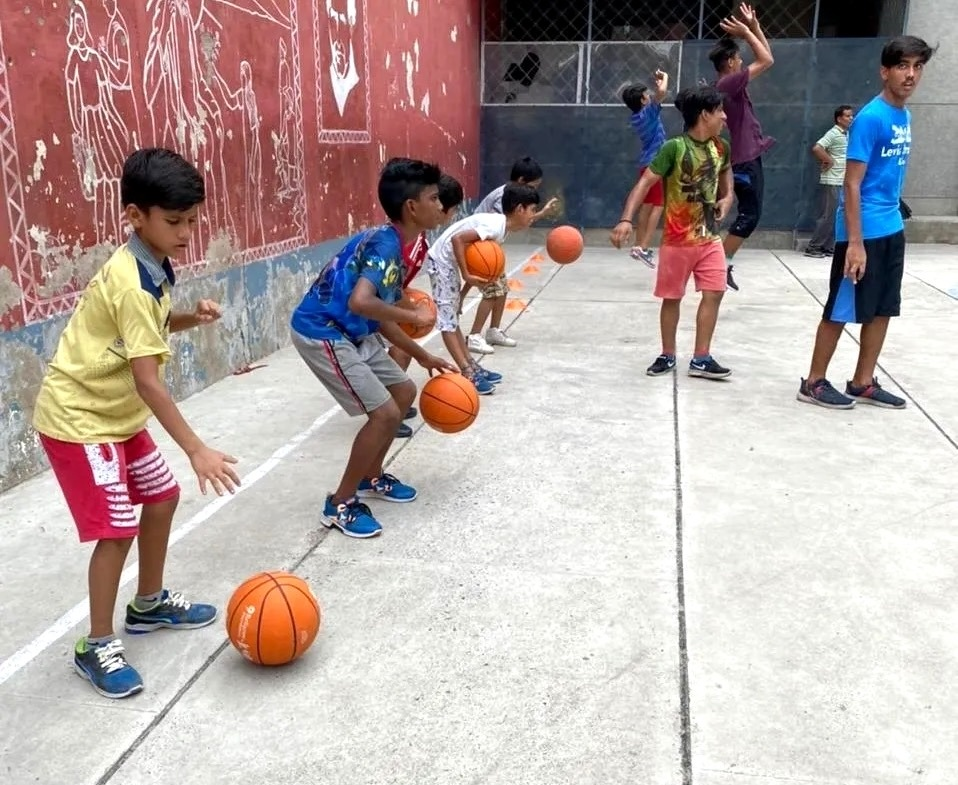
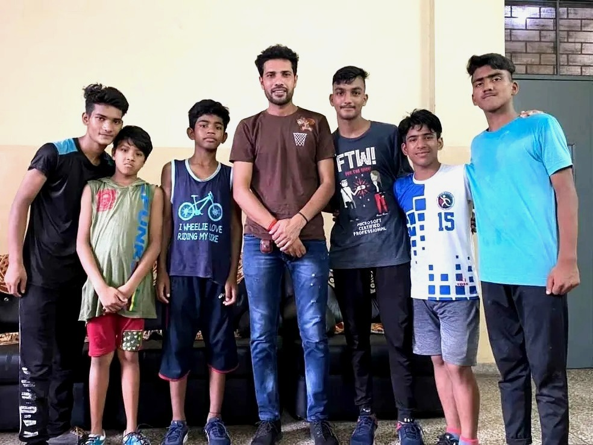
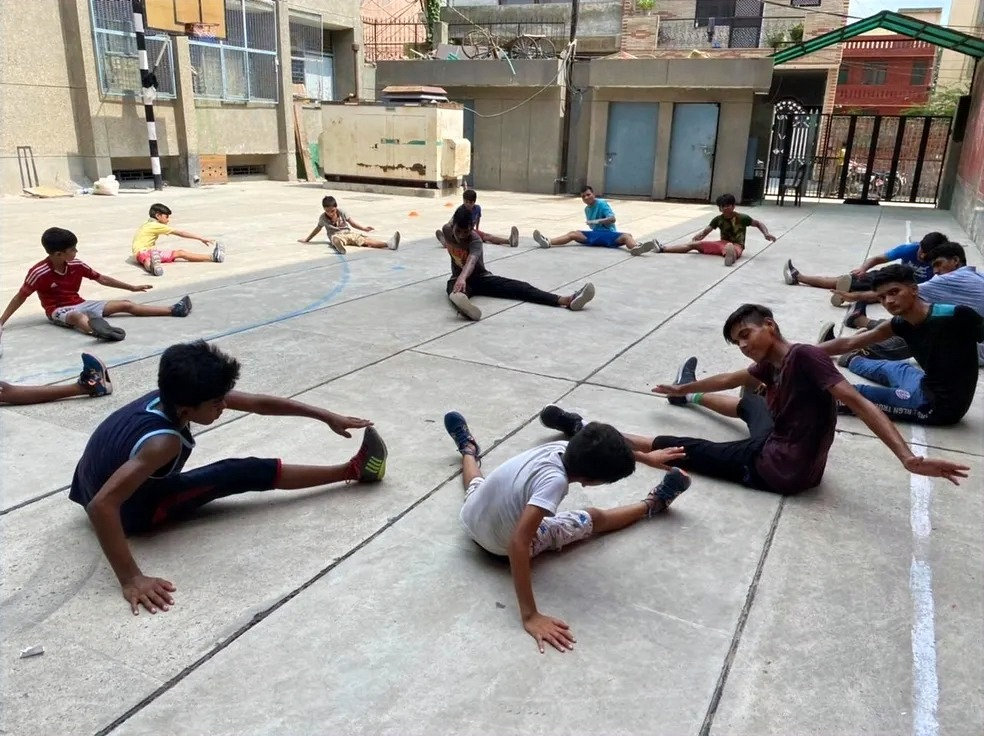

## Sports for All: Our Vision

We at IB Sports Academy truly believe in the **motto "Sports for All"**. While many students around us have a great potential that is yet to be seen or tapped into, we believe that all students just practice away from becoming great players. **_Community outreach means lending a helping hand to those who need it. Participation and interactivity increase awareness and provides a personal familiarity._** It can also help to improve the health of the community and serve as a way of giving back to the community. Realizing that we have great potential around us would only bring us closer to a better and healthier youth. Sports has always been one of the best ways to unite a community.

<figure style="display: flex; flex-direction: column; align-items: center; text-align: center;">
  
  <figcaption style="font-style: italic;">Student-athletes at Don Bosco Ashalayam training in Basketball with IB Sports Academy.</figcaption>
</figure>

## Role of Sports in Shaping Youth

Through sports, we not only **_teach the youth how to be healthy both physically and mentally but also teach them valuable lessons like Team building, a spirit of sportsmanship, unity, hard work, work ethics, teamwork, overcoming adversity, and most of all Respect._** What sports can teach someone and how it can impact the life of the student remains unmatched. Most children at young age forget how to respect those around them, team sports teach them how to not only respect their coach but also themselves, their peers, their family and teach them how to be calm during severe adversities. While India progresses in terms of sports and physical education, it is important to move forward with equity and equality.

> Many people often relate basketball with just a game that improves or might improve the height of their child but, we're here to tell you that it is much more than that. **It is a game that improves the overall health of the student, keeps them active, makes them better at building team spirit, improves their communication skills, boosts their confidence**, and much more.

<figure style="display: flex; flex-direction: column; align-items: center; text-align: center;">
  
  <figcaption style="font-style: italic;">Head Coach <b>Ishwar Bhati</b> with basketball students of Don Bosco Ashalayam. The enthusiastic students eager to learn and high potential in each of them.</figcaption>
</figure>

## Why Community Outreach Matters

Our **_main motive of starting a community outreach program was to give back to the society that has given us so much starting with the youth._** This program gives us the ability to influence the next generation to be better and to do better. Especially when it comes to children, we believe that the things that you teach them at a young age, they can carry it well into their future as they are impressionable. You will also be **_planting the idea of the importance of focusing on community service and outreach programs._** And as a result, it will influence their future, and they can also influence their parents and other siblings.



## Giving Back Through Coaching

> In the light of giving back to the society and expecting nothing in return, **IB Sports Academy has begun a community service of teaching Basketball to the young boys at Don Bosco Ashalayam**, Palam, New Delhi.

One of the key components for coaches is to teach the student-athletes about service. The aim is to mentor and build character in the lives of youth through the sport of basketball. This community service is to outreach, educate and discipline as well to encourage an active & healthy lifestyle among the boys.



As the first step towards community outreach, we have collaborated with Don Bosco Ashalayam, New Delhi. The kind of enthusiasm they showed while training was beyond anything that we have ever seen. Dedicating our time and efforts to a community that truly deserves it made it possible for us to conduct our program with them. With this, we hope to have many such programs and we hope to conduct many more workshops for a better and brighter future.



## 🏀 Ready to Elevate Your Game?

Join the movement! At **IB Sports Academy**, we’re not just building ballers — we’re cultivating championship mindsets that instill leadership, resilience, and success both on and off the court.

👉 [Train with us and unleash your potential!](https://ibsportsacademy.com/)  
🚀 Follow our journey on [ Instagram](https://www.instagram.com/ibsportsacademy/) & [ Youtube](https://www.youtube.com/@IBSportsAcademy).

💬 Have thoughts or questions? [Connect with us](https://blog.ibsportsacademy.com/contact/) or share this post with a fellow baller!