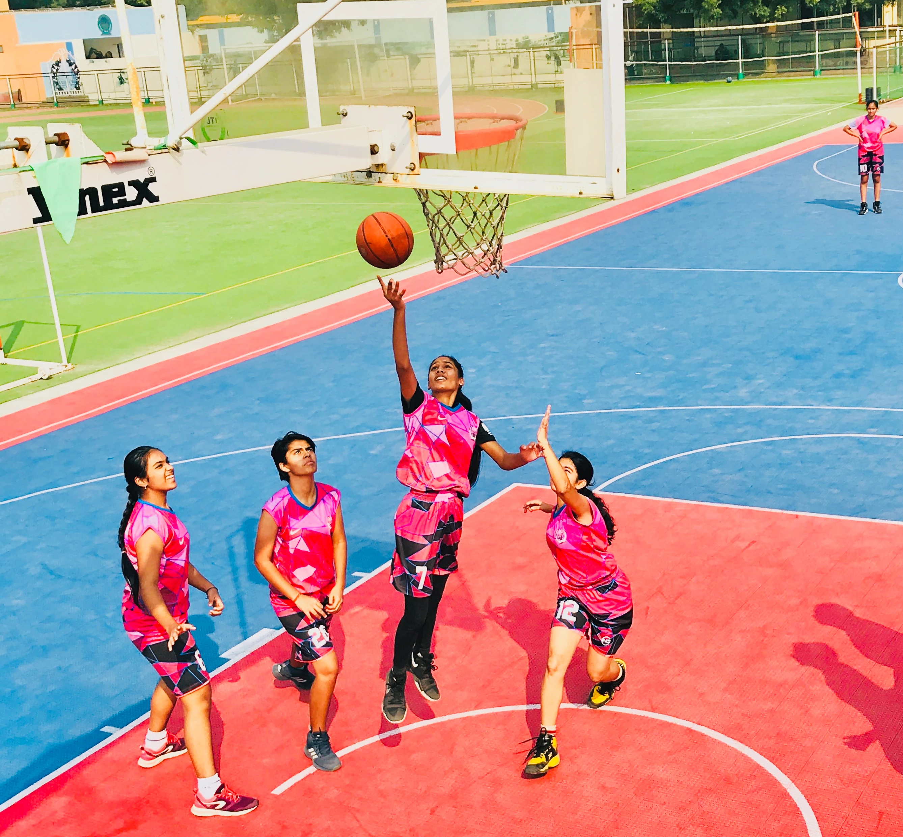
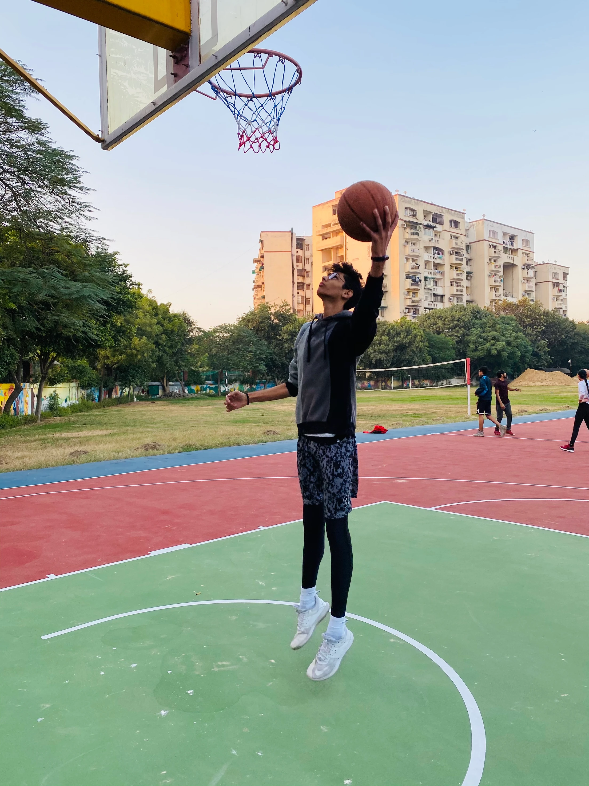

## State of Basketball in India

Basketball is a popular sport in India and is played by millions of people daily. Basketball is a team sport and is played at both professional and collegiate levels. Basketball is a game of strategy as players have to work together on the court to score baskets. The rules of basketball are universal and can be adapted to various formats to suit the needs of the players and the spectators.

**The popularity of basketball in India is on the rise thanks to the Indian Super League and the NBA.** Basketball has become a stable career for many people in India. Many people from rural areas now seek a livelihood playing professional basketball in India. **This has effectively transformed a once-neglected sport into one that has widespread support.** As more people seek to make a living from basketball, the sport will only gain momentum in India.



## Basketball vs Football in India

Basketball is only marginally more popular than football in India. Both sports are national pastimes and are broadcast daily on television channels. Many fans follow their favourite teams through the season via live games or on television broadcasts.



> Although basketball has several loyal fans, it lacks the same level of mass support as football does. In addition, many fans prefer football's more physical nature over basketball's slower tempo-oriented style. Nevertheless, basketball is growing in popularity among Indian fans of both sports.



## Role of the Indian Super League

The Indian Super League has brought basketball to many Indian fans. The Indian Super League started in February 2014 with eight teams participating. Eight teams competed through a double round-robin format before culminating in a championship game between Mumbai Indians and Chennaiyin Giants. The league expanded to 12 teams by 2017 with Bangalore as its headquarters. Fans from all over India travel to watch games at stadiums in their respective cities.

> Basketball matches now have higher attendance than other sports in major Indian cities.

## Looking Ahead

Basketball is gaining popularity among Indian fans thanks to professional leagues, television broadcasts, and high attendance numbers at stadiums. The success of the Indian Super League has made basketball more accessible for new fans and given it a boost among existing ones.

> Over time, this increase in popularity will see an increase in player wages and lead to better facilities for athletes training for the games competitive nature will only increase this support further!



## 🏀 Ready to Elevate Your Game?

Join the movement! At **IB Sports Academy**, we’re not just building ballers — we’re cultivating championship mindsets that instill leadership, resilience, and success both on and off the court.

👉 [Train with us and unleash your potential!](https://ibsportsacademy.com/)  
🚀 Follow our journey on [ Instagram](https://www.instagram.com/ibsportsacademy/) & [ Youtube](https://www.youtube.com/@IBSportsAcademy).

💬 Have thoughts or questions? [Connect with us](https://blog.ibsportsacademy.com/contact/) or share this post with a fellow baller!