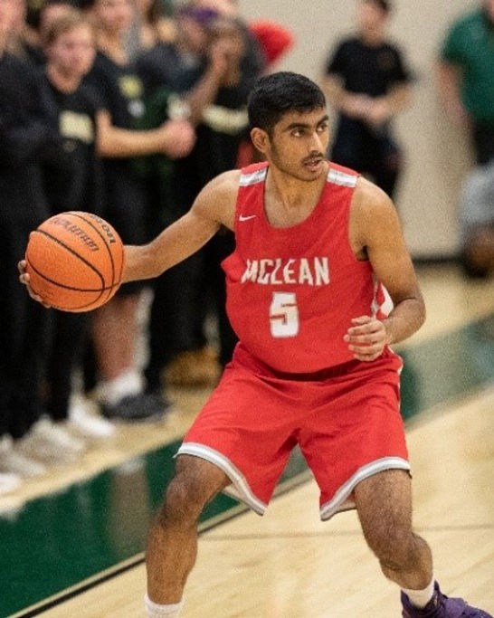
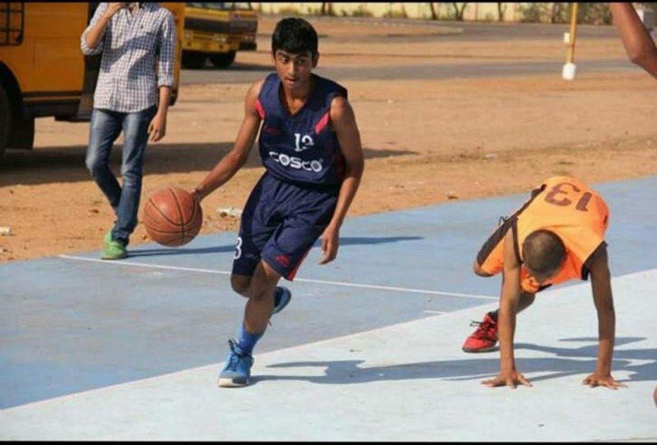
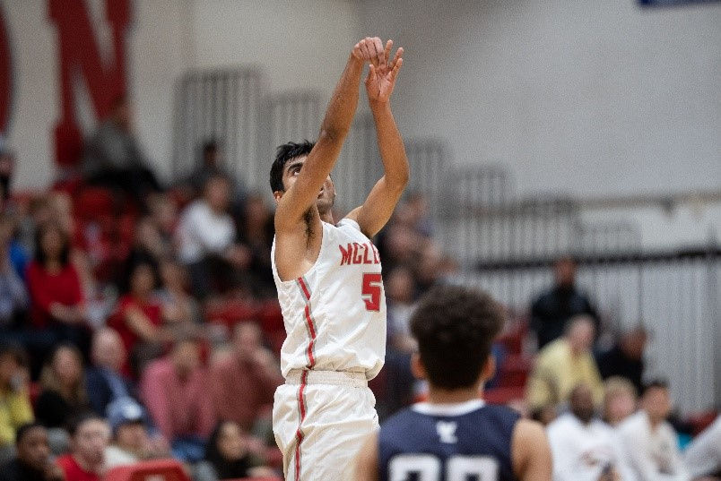

<h2 style="text-align: center;">Meet Bhuvanesh Rajagopal</h2>

<figure style="display: flex; flex-direction: column; align-items: center; text-align: center;">
  
  <figcaption style="font-style: italic;">Iowa State University, USA | B.Sc Electrical Engineering   Former Student, IB Sports Academy (2013–2017).</figcaption>
</figure>

## Learning Under Coach Ishwar Bhati

As a basketball player for nearly **7 years**, some of the best learning experiences I have had have come from **Coach Ishwar Bhati** in India.

His training at the **IB Sports Academy** has truly helped me develop a strong foundation as a player. His attention to detail helped me to truly find mistakes in how I played and how to correct them.

> Ishwar sir focuses on the fundamentals, and even as many NBA greats say, the fundamentals are the most important part of the game.

## Mastering the Fundamentals

He helped me to shoot the basketball much better as well as **work on my weaknesses such as left-hand layups and dribbling**. He made sure that I gave my best every day. Most importantly, his continued encouragement and enthusiasm never failed to keep me motivated.

## Balancing Studies and Sports

As a **student-athlete**, I have understood the importance of involving sports in my life alongside my studies. Not only does it give me a **break from studying and a chance to refocus myself, but having some form of exercise leaves me feeling energetic throughout the day.**

Dedicating time to basketball as well as studies helped me **improve my time management skills drastically**. I have to be responsible enough to make sure I use my time wisely. This made me much more conscious of how I spend my time as well as how to study more efficiently.

## Life Lessons from the Court

> **Basketball is a game with a lot of communication**, and this in turn has translated into my day-to-day life in being able to communicate effectively with my peers and teachers as well as being able to do tasks as a team/group.

The most important thing I learnt playing basketball is **hard work and perseverance**. There is no replacement for hard work, and playing sports has helped me to bring that relentlessness into my studies and day-to-day life.

<figure style="display: flex; flex-direction: column; align-items: center; text-align: center;">
  
  <figcaption style="font-style: italic;">Bhuvanesh Rajagopal playing Basketball at McLean High School (2017–2020).</figcaption>
</figure>

## 🏀 Ready to Elevate Your Game?

Join the movement! At **IB Sports Academy**, we’re not just building ballers — we’re cultivating championship mindsets that instill leadership, resilience, and success both on and off the court.

👉 [Train with us and unleash your potential!](https://ibsportsacademy.com/)  
🚀 Follow our journey on [ Instagram](https://www.instagram.com/ibsportsacademy/) & [ Youtube](https://www.youtube.com/@IBSportsAcademy).

💬 Have thoughts or questions? [Connect with us](https://ibsportsacademy.github.io/blog/contact/) or share this post with a fellow baller!

## Comments

**Bhuvanesh Rajagopal**  
*May 31, 2021*  
> Thank you Ishwar Sir for your persistent guidance and coaching for not only helping me improve my basketball skills immensely, but also helping me grow as a person! It was such a great experience at the IB academy, and I'm honored to be on your website! Thank you for everything sir!  

**Ishwar Bhati**  
*May 31, 2021*  
> Bhuvanesh, you have it within you. Just keep your basics strong, rise and shine. It was a privilege itself to coach you. God bless you.