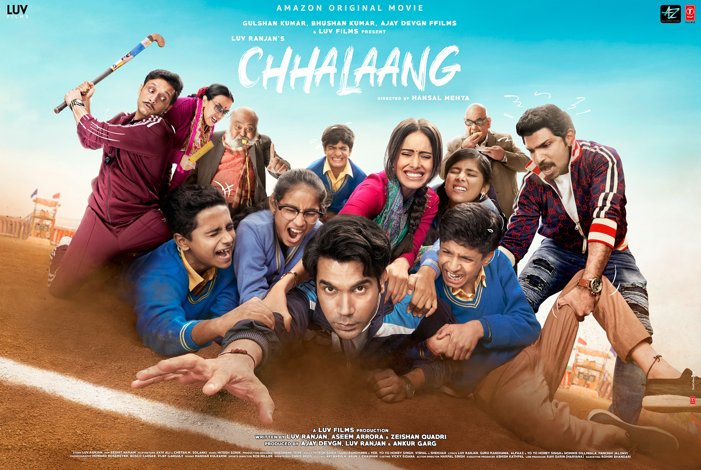
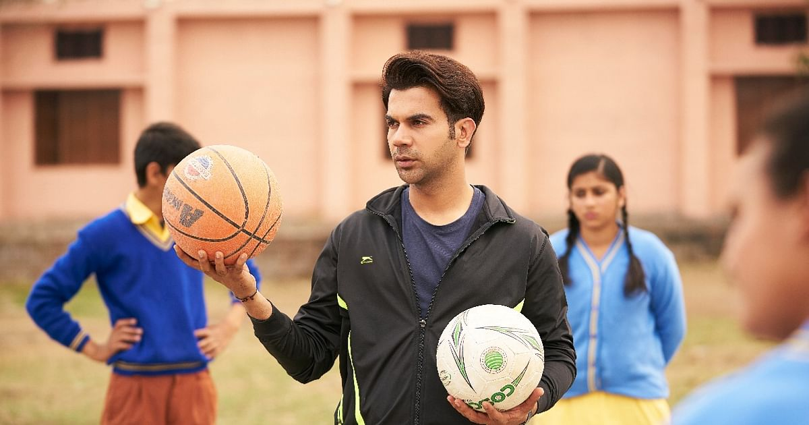
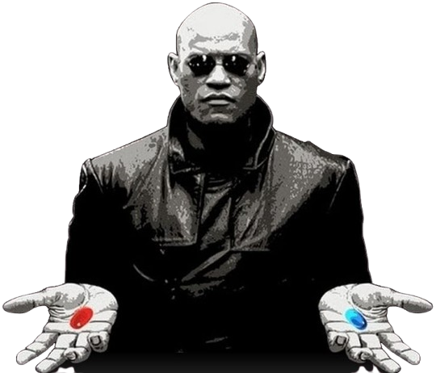
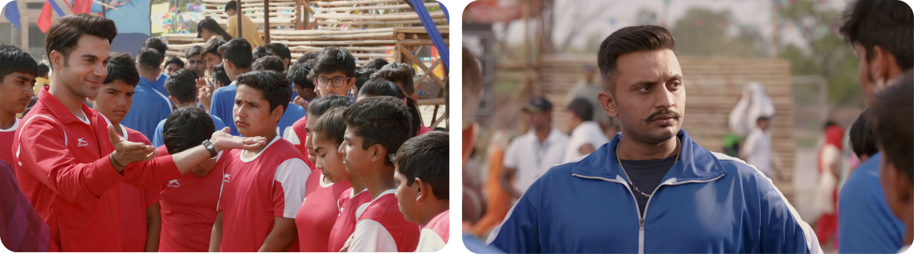
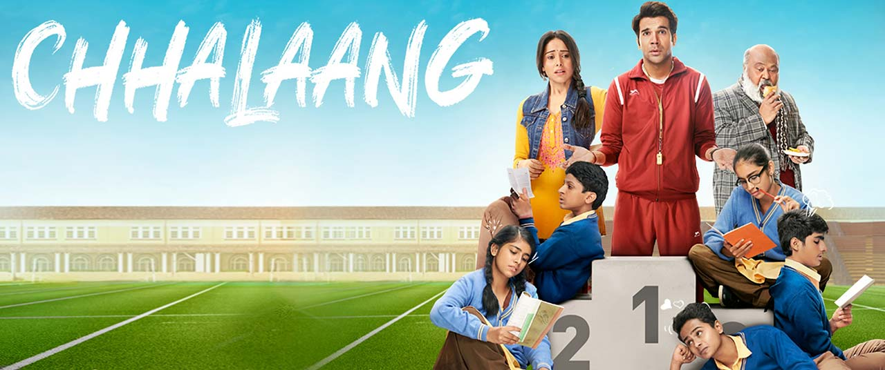
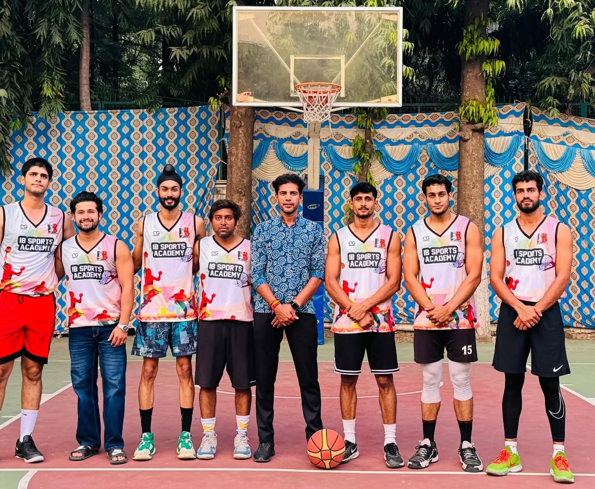

> "Hamare desh mein na har koi chahta hai ki unka beta Sachin Tendulkar, beti Saina Nehawal bane....." – Coach Montu

As a PT teacher and basketball coach, you rarely see mainstream cinema reflecting the real joys and challenges of coaching. Then comes a film like *Chhalaang*, a movie that hits home in more ways than one. It’s not just about a teacher. It’s about transformation. It’s about belief. It’s about the underdogs, our students, finding their voice, their strength, and their moment.

<figure style="display: flex; flex-direction: column; align-items: center; text-align: center;">
  
  <figcaption style="font-style: italic;">Chhalaang Movie: A must watch for Students, Teachers, Parents & Coaches.</figcaption>
</figure>

## 🏀 From Benchwarmers to Believers

In *Chhalaang*, Rajkummar Rao plays a lazy, reluctant PT teacher who’s more into chilling than coaching, until he's pushed to prove his worth. What starts as a personal challenge turns into a powerful mission: to inspire a group of overlooked, underestimated kids to believe in themselves and compete head-to-head with the “elite” players.

This reminded me so much of real coaching life.

How often do we see kids written off at 10/100? Called "slow," "not talented," or "just average"? But sports is the great equalizer. It doesn’t care where you come from, it cares how much heart you bring. And with the right guidance, even those who are counted out can rise, improve, compete, and **win** - in games and in life.

> "Teacher ka kaam hai sikhana. 90 laane waale ko 100 tak toh koi bhi le ja sakta hai. 10 waale ko 40 tak le jaao toh baat hai" – Teacher Neelu

<figure style="display: flex; flex-direction: column; align-items: center; text-align: center;">
  
  <figcaption style="font-style: italic;">Chhalaang Movie: Rajkumar Rao a.k.a. Coach Montu teaching Basketball and sports to Underdogs</figcaption>
</figure>

## 🔴🔵 Red Pill, Blue Pill - Two Coaches, Two Realities

<figure style="display: flex; flex-direction: column; align-items: center; text-align: center;">
  
  <figcaption style="font-style: italic;">Which Coach Would You Choose</figcaption>
</figure>

<figure style="display: flex; flex-direction: column; align-items: center; text-align: center;">
  
  <figcaption style="font-style: italic;">Team Red after Losing vs Team Blue after Winning</figcaption>
</figure>

The two teams face off in three intense showdowns: **Basketball**, **Relay Race**, and **Kabaddi**, testing not just their skills, but their teamwork, mindset, and will to win.

One of my favorite scenes in Chhalaang doesn’t even involve a match, it’s what happens after the match.

The red team, the underdogs, just lost. But their coach doesn’t scold them. Instead, he lifts them up, reminding them they played like champions.

> "80 points se jeetne waali team sirf 8 points se jeeti hai bas. You made that possible!”

It’s not a consolation. It’s a reframing of belief, he tells them: you belong here.

Meanwhile, the blue team, the winners, are pumped, until their coach hits them with cold logic.

> “80 points se haarne waali team sirf 8 points se haari hai bas. Nothing to celebrate.”

That’s not just a reality check, it’s a celebration hijacked by perfectionism. You can see it on their faces: their joy replaced with confusion, maybe even doubt.

And this is where it hit me like a scene from The Matrix:
You’ve got two pills, two coaching philosophies.

🔴 Red pill: Encourage effort, build belief, nurture growth.  
🔵 Blue pill: Demand perfection, push discipline, focus on results.

Which one builds champions? Which one builds people?

## 🧠🧘‍♂️ Sports Is Education Too

After the underdogs pull off the unthinkable and win, Coach Montu doesn’t just celebrate the victory, he delivers a mic-drop moment that stays with you long after the final whistle. Standing before the crowd, he reminds everyone that behind every great athlete is someone who believed in them before the medals came: **a parent, a teacher, a coach.**

> "Humaare desh mein na har koi chahta hai ki unka beta Sachin Tendulkar bane, beti Saina Nehwal bane. Par Sachin aur Saina ka maa-baap koi na banna chahta.   
> Sachin Tendulkar, Saina Nehwal, Virat Kohli, Sania Mirza, P.V. Sindhu, Dipa Karmakar, Vishwanathan Anand, Abhinav Bindra, Dhanraj Pillay, Pullela Gopichand, Dhyan Chand, Sakshi Malik, Geeta Phogat, P.T. Usha, Mary Kom, Sunil Gavaskar, Kapil Dev, Mithali Raj, Bhaichung Bhutia, Sunil Chhetri, Mahendra Singh Dhoni, and many many more.   
> Yeh banne ke liye inke maa-baap, inke coach, inke PT master banne ki zaroorat parti hai. Akele na ban pata koi. Humaare bacche bhi ban jaayenge, par uske pehle hume banna padega" – Coach Montu

That line hit deep. Every coach, every teacher has heard some version of this. Parents dream of greatness for their kids, but often forget the value of supporting them through the ups and downs. The movie shows how the other teacher and coach's father visits each parent, one by one, convincing them not just to *let* their kids play, but to truly **believe** in them.

We need more of that. Because **Sports is not a Distraction. It’s a Discipline!** It teaches resilience, time management, leadership, respect, health, humility, and confidence. A basketball court or a football field is just as much a classroom as any other.

## 👨‍🏫 What a Coach Can Do

*Chhalaang* isn’t just about the students. It’s about the journey of the coach too. His evolution from disinterested instructor to driven mentor was truly inspiring. As a PT teacher, I saw my own story in parts of his: that moment when you stop teaching and start leading. When your mission becomes bigger than the syllabus, **you’re building people.** 

And that’s exactly what we aim to do every day at **IB Sports Academy**, not just train athletes, but shape confident, disciplined, and inspired individuals ready to take on the world.

And yes, the ending was a bit “movie-style”, the underdogs somehow clinch victory. But honestly? That’s the dream every coach holds. Not just to win trophies, but to watch your kids grow from unsure to unstoppable.

<figure style="display: flex; flex-direction: column; align-items: center; text-align: center;">
  
  <figcaption style="font-style: italic;">Chhalaang Movie: A must watch for Students, Teachers, Parents & Coaches.</figcaption>
</figure>

## 💡 Lessons On and Off the Field

Here are some of the most powerful messages from *Chhalaang* that every parent, coach, and young athlete should take to heart:

- **Belief is the first step.** Kids become what you believe about them.
- **Playing is not wasting time.** It’s building life skills, body strength, and mental toughness.
- **Support matters.** Every Sehwag, every Sindhu, every Chhetri had someone who stood behind them.
- **School sports are serious.** It’s not just “extra” activity. It’s essential.
- **Coaches shape futures.** With the right mix of discipline and inspiration, a coach can change lives.
- **Balance is key.** Sports and studies must go hand in hand, for full development, not just marksheets.

## 💬 Coach’s Corner

After watching Chhalaang, I was left with fire in my heart and a notebook full of quotes. Here are a few that still stick with me:

> "Khelne se padhai bigadti nahi hai... par sirf padhai se zindagi banegi, yeh zaruri nahi."

> "Haar-jeet toh lagi rehti hai. Ladayi se pehle faisla kabhi mat sunana, na mukil ko, na khud ko... chahe kitna bhi saaf kyun na dikhayi de raha ho ki haar hogi, faisla to jirah ke baad hi hoga. Beta, jeet aksar unki ho jaya karti hai jo haar manna taal-te chale jaate hain. Bas ek gawaah aur, ek sawaal aur. Bas ek jirah aur. Chhorna mat." – Montu’s Father (Wakeel Sahab)

> 🎓 Did You Know? Rajkummar Rao Was a Teacher Before Becoming a Bollywood Star?
In fact, he was the youngest teacher in school! 
Before lighting up the silver screen with his incredible performances, Rajkummar Rao actually worked as a dance and drama teacher! 🎭🕺

## 📣 A Call to All Parents and Teachers

**If you’re a parent reading this: let your kids play.** Not just on Sundays or after exams. Let them *train.* Let them fall, sweat, lose, and rise. Support them not because you see a medal, but because you see a child growing stronger every day.

**If you’re a teacher or coach: keep going.** Your words matter. Your energy lifts. Your faith changes futures.

**And if you’re a student-athlete: keep hustling.** Whether you're the first pick or the last one on the bench, your story is being written with every drop of sweat. One day, your *Chhalaang* will come.

## 🎬 Final Thoughts

*Chhalaang* isn’t just a film — it’s a reminder. That every child deserves a chance. That every game is a lesson. And that when coaches, parents, and kids come together, magic happens.

Just like on our courts here at IB Sports Academy, where every day, we don’t just coach games. We coach greatness.

<figure style="display: flex; flex-direction: column; align-items: center; text-align: center;">
  
  <figcaption style="font-style: italic;">Team IB Sports Academy with Head Coach Ishwar Bhati</figcaption>
</figure>

## 🏀 Ready to Elevate Your Game?

Join the movement! At **IB Sports Academy**, we’re not just building ballers — we’re cultivating championship mindsets that instill leadership, resilience, and success both on and off the court.

👉 [Train with us and unleash your potential!](https://ibsportsacademy.com/)  
🚀 Follow our journey on [ Instagram](https://www.instagram.com/ibsportsacademy/) & [ Youtube](https://www.youtube.com/@IBSportsAcademy).

💬 Have thoughts or questions? [Connect with us](https://blog.ibsportsacademy.com/contact/) or share this post with a fellow baller!
