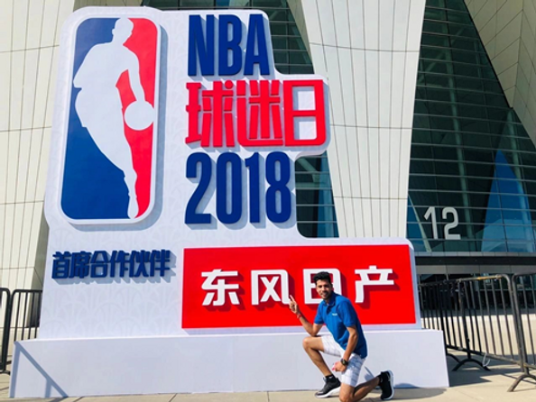
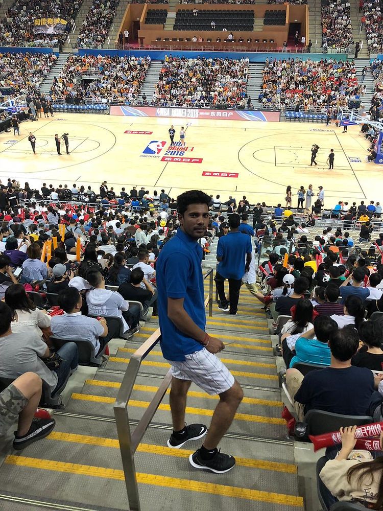
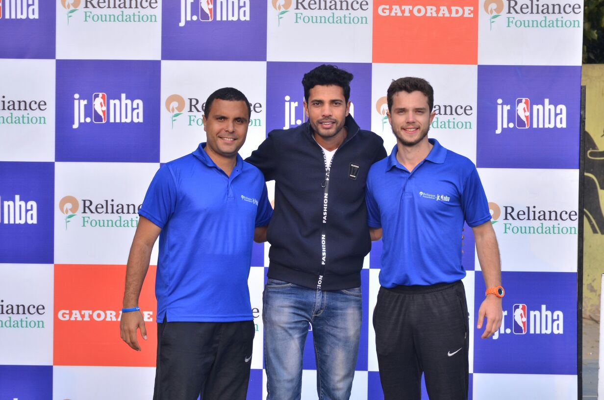

## Selected for NBA China Games

<figure style="display: flex; flex-direction: column; align-items: center; text-align: center;">
  
  <figcaption style="font-style: italic;">Coach Ishwar Bhati (Delhi) among the 8 Indian coaches selected to attend NBA China Games in Shanghai and Shenzhen.</figcaption>
</figure>

**NEW DELHI:** Delhi based physical education teacher Mr. Ishwar Bhati was recommended by NBA India for his exceptional achievements in field of Basketball. He was selected as the Best Coach during the Reliance Foundation Jr. NBA youth basketball development programme 2017-18, held in Delhi. He was gratified with an invitation for NBA experience trip along with NBA representatives in Shanghai, China.

> ISHWAR, head coach at IB Sports Academy, Dwarka, New Delhi, was picked along with seven other Indian coaches from various cities across India for travel to China to attend the premier US basketball league's showpiece Asian event which was held at the Chinese cities of Shanghai and Shenzhen.

## Indian Coaches Selected

Indian coaches travelling to China for this programme include Jose Sebastian (Thiruvanathapuram), Shabana Patel (Mumbai), Ravi Kumar (Bengaluru), Ganesh Prabhu (Chennai), Ishwar (New Delhi), Tua Ghatak (Kolkata), Ibrahim Rose Khan (Hyderabad), and Ravinder Kaur (Punjab).

The coaches took part in the seventh annual NBA Fan Day event in Shanghai on October 4 and then attended the two games in Shanghai and Shenzhen later in the week. Even though it's just the preseason, the coaches relished some top-notch NBA action and gleaned from coaches like Brett Brown and Rick Carlisle on the sidelines.

## Ishwar Bhati’s Coaching Philosophy

Ishwar ignited the passion for basketball admired by his coach himself. The ideology of being **"firm in the basics and smooth with the finals"** has pushed boundaries for his students to reach nationals. In 15 years of his professional experience, he has managed to develop a core liking for the sport in his school, ITL Public School, Dwarka. Students not only want to play the sport for the school, but they even want to pursue it for higher education.

## IB Sports Academy’s Vision

Also, his Basketball academy **IB SPORTS ACADEMY** pursues each age group, not only open doors but also hearts to welcome you on the court. The primary goal of the Academy is to **_raise the level of Basketball and improve India’s performance internationally_** across various age groups. The team of coaches have always looked for innovative drills and exercises to suit the individual needs of every trainee instead of relying on a "one size fits all" approach.

> "We have players of various age groups, ranging from 10 to 25 years in the academy. Each one is catered according to his abilities, they are enthusiastic to learn and have a vision for the sport. The core ability lies in your WILL, If you will to, I will guide you the way. That is best assured." said Ishwar

<figure style="display: flex; flex-direction: column; align-items: center; text-align: center;">
  
  <figcaption style="font-style: italic;">A key reformer in students' lives, Ishwar has overseen all aspects of player development and coaching student-athletes for high school age prospects.</figcaption>
</figure>

## 🏀 Ready to Elevate Your Game?

Join the movement! At **IB Sports Academy**, we’re not just building ballers — we’re cultivating championship mindsets that instill leadership, resilience, and success both on and off the court.

👉 [Train with us and unleash your potential!](https://ibsportsacademy.com/)  
🚀 Follow our journey on [ Instagram](https://www.instagram.com/ibsportsacademy/) & [ Youtube](https://www.youtube.com/@IBSportsAcademy).

💬 Have thoughts or questions? [Connect with us](https://ibsportsacademy.github.io/blog/contact/) or share this post with a fellow baller!